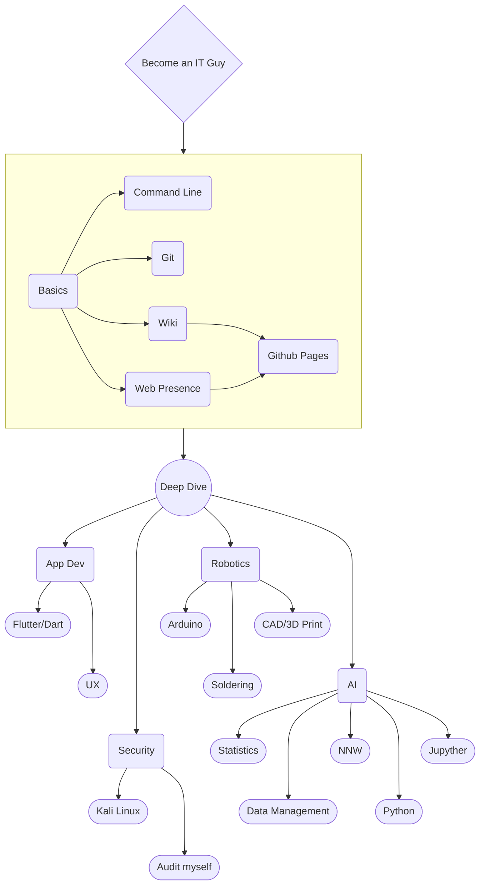

```mermaid
flowchart TD
    subgraph Basics [ ]
    B(Basics) --> B1(Command Line)
    B --> B4(Git)
    B --> B2(Wiki)
    B --> B3(Web Presence)
    B2 --> B21(Github Pages)
    B3 --> B21
    end

    A{Become an IT Guy}
    A --> Basics(Web presence)
    Basics --> C((Deep Dive))

    C --> C1(App Dev)
    C -----> C2(Security)
    C --> C3(Robotics)
    C ----> C4(AI)

    C1 --> C11([Flutter/Dart])
    C1 ---> C12([UX])

    C2 --> C21([Kali Linux])
    C2 ---> C22([Audit myself])

    C3 --> C31([Arduino])
    C3 ---> C32([Soldering])
    C3 --> C33([CAD/3D Print])

    C4 --> C41([Statistics])
    C4 ---> C42([Data Management])
    C4 --> C43([NNW])
    C4 ---> C44([Python])
    C4 --> C45([Jupyther])
```
